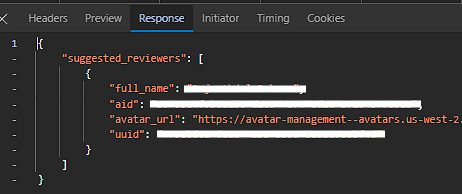

## Automate Pull Request 

this project i create bcz im lazy for pull request 🤯

## How to use

1. Node js Requirement  min 14
2. Install library first
`npm install colors dotenv axios`
3. Hit npm install first 
`npm install`
4. Rename .env.example to .env
5. How to get **Bitbucket repository slug and owner**
Go to your project repository in bitbucket then find the url
The url look like this:
`https://bitbucket.org/{BITBUCKET_REPO_OWNER}/{BITBUCKET_REPO_SLUG}/`
6. How to get **Bitbucket Reviewer UID and name**
Go to `https://bitbucket.org/{BITBUCKET_REPO_OWNER}/{BITBUCKET_REPO_SLUG}/pull-requests/new`
Then  *F12* or *Right Click and Inspect Element*
After that go to *Network* and search request call **/recommended-reviewers** and go to tab **Response**

7. After that just fill the env value
8. After that open file **automate-pull-request.js**
9. Search code `const branches = []; //? Replace with your branch names`
Then fill your branch names
Example: `const branches = ['branch-1', 'branch-2'];`
10. After your setup finished, open your terminal
11. Hit command `node automate-pull-request.js`
12. Congratulations 🎉